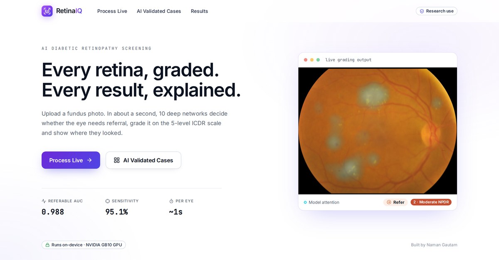

# RetinaIQ: AI diabetic retinopathy screening

### 👉 [Open the live site: retinaiq.pages.dev](https://retinaiq.pages.dev)

Live site of the RetinaIQ project: 10 deep networks (EfficientNet-B5 + ConvNeXt) grade a colour fundus photo on the
5-level ICDR scale, decide whether the eye needs referral and show where they looked (Grad-CAM).

- **AI Validated Cases**: all 313 held-out test photos, the doctor's grade next to the model's, with attention maps.
- **Results**: referable AUC 0.988, sensitivity 95.1%, quadratic weighted kappa 0.944 on the held-out test set.
- **Process Live**: a recorded run. The model runs on-device on an NVIDIA GB10 GPU (~1 s per eye).

Research prototype, not for clinical diagnosis. Built by Naman Gautam.

---
This folder is generated by `python main.py export-static` in the RetinaIQ source project and served as a static site
by Cloudflare Pages (framework preset: None, build command: empty, output directory: `/`).
